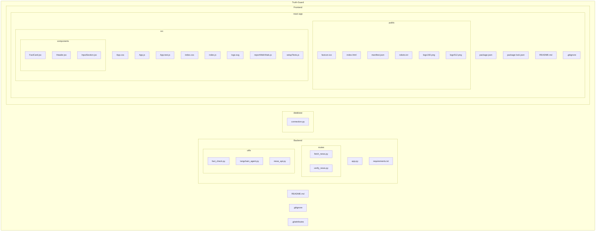

## Project file structure

This file shows the repository layout as an ASCII tree and a Mermaid diagram you can use to present or render the structure.

### ASCII tree

Truth-Guard/
├─ .gitattributes
├─ .gitignore
├─ README.md
├─ Backend/
│  ├─ app.py
│  ├─ requirements.txt
│  ├─ routes/
│  │  ├─ fetch_news.py
│  │  └─ verify_news.py
│  └─ utils/
│     ├─ fact_check.py
│     ├─ langchain_agent.py
│     └─ news_api.py
├─ database/
│  └─ connection.py
└─ Frontend/
   └─ react-app/
      ├─ .gitignore
      ├─ package.json
      ├─ package-lock.json
      ├─ README.md
      ├─ public/
      │  ├─ favicon.ico
      │  ├─ index.html
      │  ├─ manifest.json
      │  ├─ robots.txt
      │  ├─ logo192.png
      │  └─ logo512.png
      └─ src/
         ├─ App.css
         ├─ App.js
         ├─ App.test.js
         ├─ index.css
         ├─ index.js
         ├─ logo.svg
         ├─ reportWebVitals.js
         └─ setupTests.js
         └─ components/
            ├─ FactCard.jsx
            ├─ Header.jsx
            └─ InputSection.jsx

### Mermaid diagram

The diagram below uses Mermaid's `graph` + `subgraph` syntax. You can paste the snippet into mermaid.live, the VS Code Mermaid preview extension, or GitHub (if mermaid is enabled) to render it.

### How to use

- To share a quick visual: open `docs/file_structure.md` on GitHub (if Mermaid rendering is enabled) or paste the Mermaid block into https://mermaid.live to export PNG / SVG.
- To view locally in VS Code: install the "Markdown Preview Mermaid Support" or "Mermaid Preview" extension and open the markdown file.

If you'd like, I can also:
- generate a PNG/SVG of the Mermaid diagram and add it to `docs/`;
- create a simplified one-page presentation (PDF) showing only top-level modules.

---

Generated automatically on October 15, 2025.
