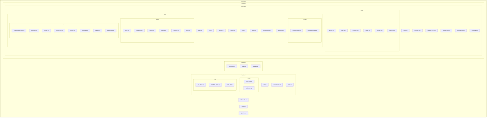

## Project file structure (refreshed)

This document contains a complete, up-to-date listing of the repository structure as an ASCII tree and a Mermaid diagram. Use the Mermaid block below in mermaid.live or a VS Code Mermaid preview to render a visual.

### ASCII tree

Truth-Guard/
├─ .gitattributes
├─ .gitignore
├─ README.md
├─ Backend/
│  ├─ app.py
│  ├─ requirements.txt
│  ├─ news.db
│  ├─ routes/
│  │  ├─ fetch_news.py
│  │  └─ verify_news.py
│  └─ utils/
│     ├─ fact_check.py
│     ├─ langchain_agent.py
│     └─ news_api.py
├─ database/
│  ├─ connection.py
│  ├─ database.py
│  └─ news.db
├─ docs/
│  └─ file_structure.md
└─ Frontend/
   └─ react-app/
      ├─ .gitignore
      ├─ package.json
      ├─ package-lock.json
      ├─ postcss.config.js
      ├─ tailwind.config.js
      ├─ README.md
      ├─ public/
      │  ├─ favicon.ico
      │  ├─ index.html
      │  ├─ manifest.json
      │  ├─ robots.txt
      │  ├─ logo192.png
      │  └─ logo512.png
      └─ src/
         ├─ App.css
         ├─ App.js
         ├─ App.test.js
         ├─ index.css
         ├─ index.js
         ├─ logo.svg
         ├─ reportWebVitals.js
         ├─ setupTests.js
         ├─ context/
         │  ├─ ThemeContext.jsx
         │  └─ UserPrefsContext.jsx
         ├─ pages/
         │  ├─ About.jsx
         │  ├─ Dashboard.jsx
         │  ├─ History.jsx
         │  ├─ Settings.jsx
         │  ├─ Trending.jsx
         │  └─ Verify.jsx
         └─ components/
            ├─ CustomizationPanel.jsx
            ├─ FactCard.jsx
            ├─ Header.jsx
            ├─ InputSection.jsx
            ├─ Navbar.jsx
            ├─ NewsCard.jsx
            ├─ Sidebar.jsx
            ├─ StatsWidget.jsx

### Mermaid diagram

Paste the block below into mermaid.live or a Mermaid preview to render and export the diagram.

### How to use

- To render quickly: paste the Mermaid block into https://mermaid.live and export as PNG/SVG.
- In VS Code: install "Markdown Preview Mermaid Support" or "Mermaid Preview" and open this file.
- To include the rendered image in the repo: let me know and I'll generate a PNG/SVG and add `docs/structure.png`.

---

Refreshed on October 15, 2025.
